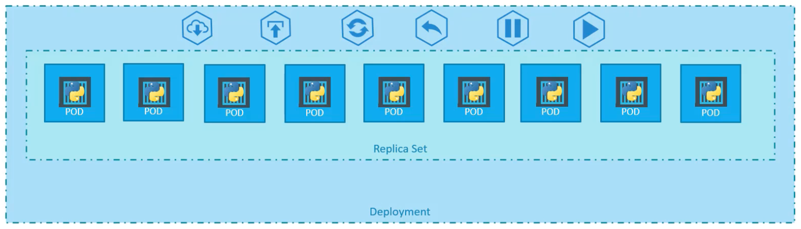
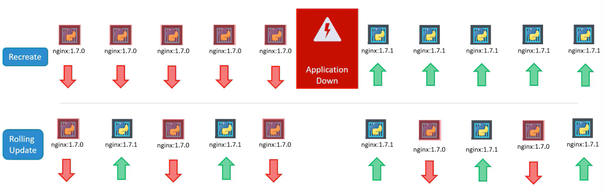
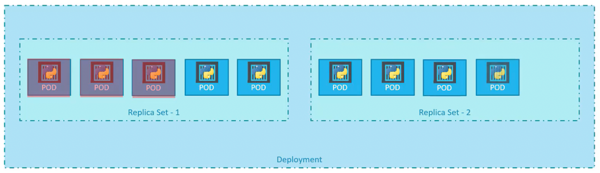
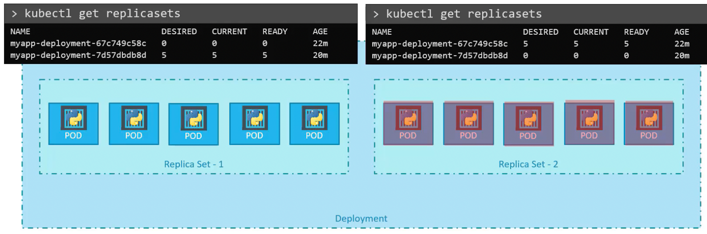

- **Provides the capability to upgrade the instances seamlessly using rolling updates, rollback to previous versions seamlessly, undo, pause and resume changes as required.**
- Abstraction over [ReplicaSet](/posts/replicaset/index.md).
- **Blueprint for stateless pods** (application layer).
- When a deployment is created, it automatically creates a [ReplicaSet](/posts/replicaset/index.md) which in turn creates pods. If we run `k get all` we can see the resources created by deployment.

# Config YAML file

```yaml
apiVersion: apps/v1
kind: Deployment
metadata:
  name: httpd-frontend
  labels:
    name: frontend
spec:
  replicas: 3
  selector:
    matchLabels:
      name: frontend
  template:
    metadata:
      labels:
        name: frontend
    spec:
      containers:
      - name: httpd
        image: httpd:2.4-alpine
```


⛔ Update the `kind` from `Replicaset` to `Deployment` in a `Replicaset` config file.


# Deployment Strategy



There are two deployment strategies:

- **Recreate**: Bring down all the running containers and then bring up the newer version (application downtime)
- **Rolling Update** (default): Bring down a container and then bring up a new container one at a time (no application downtime)

# Rollout and Versioning

- When you first create a deployment, it triggers a rollout which creates the first revision of the deployment. Every subsequent update to the deployment triggers a rollout which creates a new revision of the deployment. This keeps a track of the deployment and helps us rollback to a previous version of the deployment if required.
- **When we upgrade the version of a deployment, a new replica set is created** under the hood where the new pods are spawned while bringing down pods from the old replica set one at a time, following a rolling update strategy. We can see the new and old replica sets by running `k get replicasets`
    
    
    
- `k rollout status deployment <deployment-name>` - view the status of rollout for a deployment
- `k rollout history deployment <deployment-name>` - view the history of rollouts for a deployment
- `k rollout history deployment <deployment-name> --revision=1` - view the status of rollouts for a deployment revision

# Rollback

- When we rollback to the previous version of a deployment, the pods in the current replica set are brought down one at a time while spawning pods in the previous replica set.
- Rollback a deployment - `k rollout undo deployment <deployment-name>`
- Rollback a deployment to a specific revision - `k rollout undo deployment <deployment-name> --to-revision=1`

    