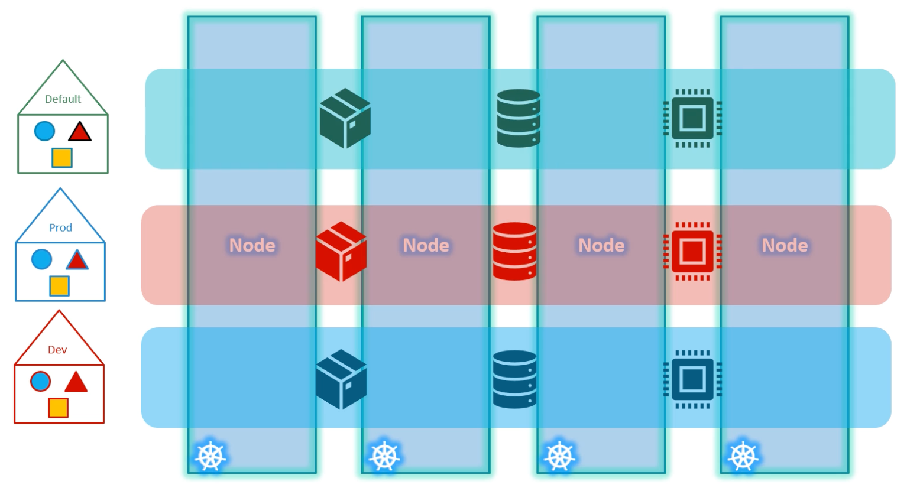
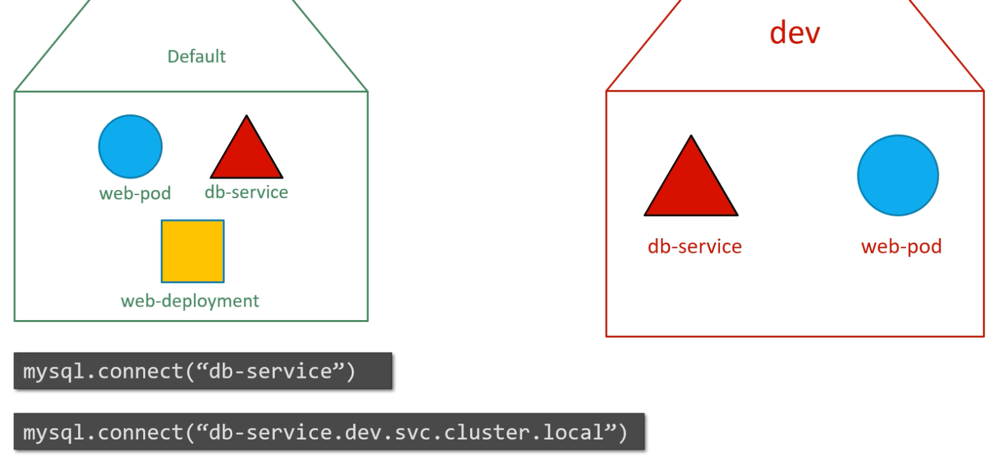
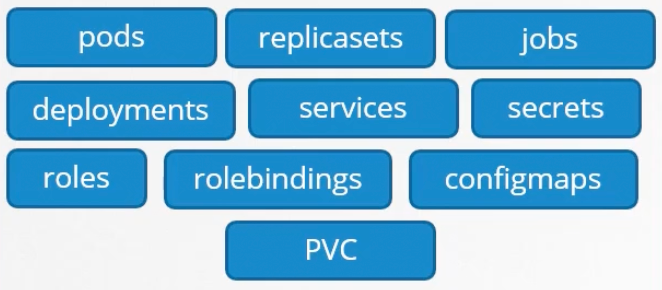
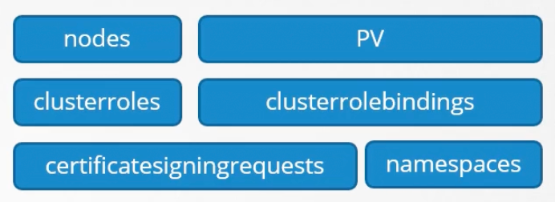

- Namespaces isolate resources within a Kubernetes cluster.
- Kubernetes creates a `default` namespace when the cluster is created. This default namespace is used to create resources.
- If the cluster is deployed using KubeAdmin, it also creates a namespace `kube-system` in which all the internal K8s resources are deployed.
- Resource limits can be placed at the namespace level. So, if we are using the same cluster for both `dev` and `prod` namespaces, we can place a resource limit on the `dev` namespace to prevent it from starving the `prod` namespace.

## DNS Resolution

- Resources within a namespace can refer to each other by their names.
- For cross namespace communication, a resource needs to specify the namespace as shown below.



`cluster.local` - domain name for the cluster

`svc` - subdomain for service object

`dev` - namespace

`db-service` - service in the `dev` namespace

# Creating a namespace

- Imperative command: `k create namespace <namespace>`
- Declarative manifest file
    
    ```yaml
    apiVersion: v1
    kind: Namespace
    metadata:
    	name: dev
    ```
    

# Creating resources in a namespace

- Command line: `k apply -f pod.yml --namespace=dev` (untracked)
- Config file (tracked): Use the namespace `property` under the metadata section. This will always create the resource in the specified namespace.
    
    ```yaml
    metadata:
    	namespace: dev
    ```
    

# Set namespace permanently

`k config set-context $(kubectl config current-context) --namespace=dev set-context`

# Specify Resource Quota for a Namespace

Create a K8s `ResourceQuota` and specify the namespace in the `metadata` section.

```yaml
apiVersion: v1
kind: ResourceQuota
metadata:
	name: compute-quota
	namespace: dev
spec:
	hard:
		pods: "10"
		requests.cpu: "4"
		requests.memory: 5Gi
		limits.cpu: "10"
		limits.memory: 10Gi
```

# Namespace vs Cluster Scope

Some objects in K8s are not scoped under a namespace, but are scoped under the whole cluster. 

### Namespace scoped



### Cluster Scoped

