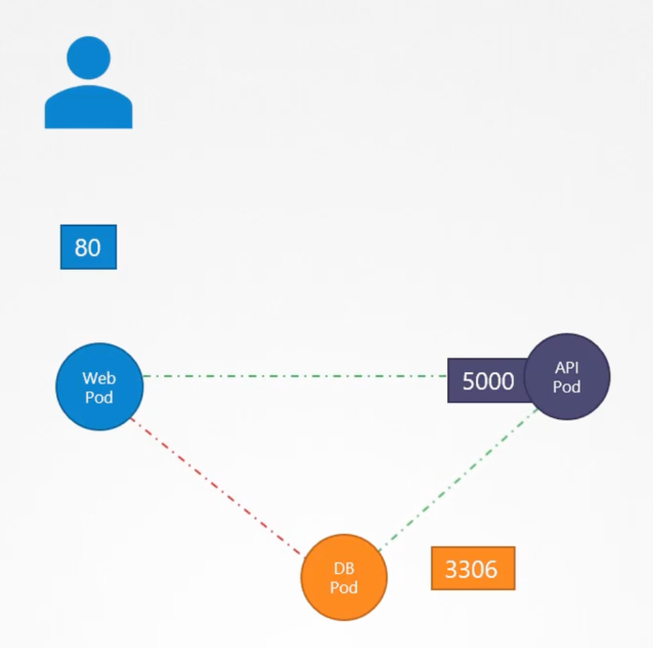
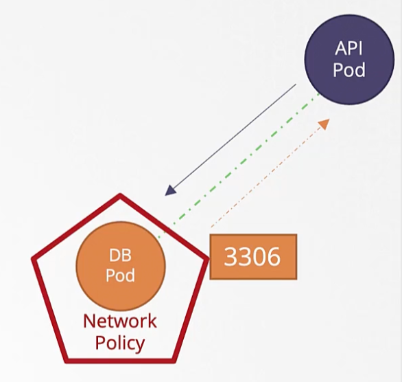
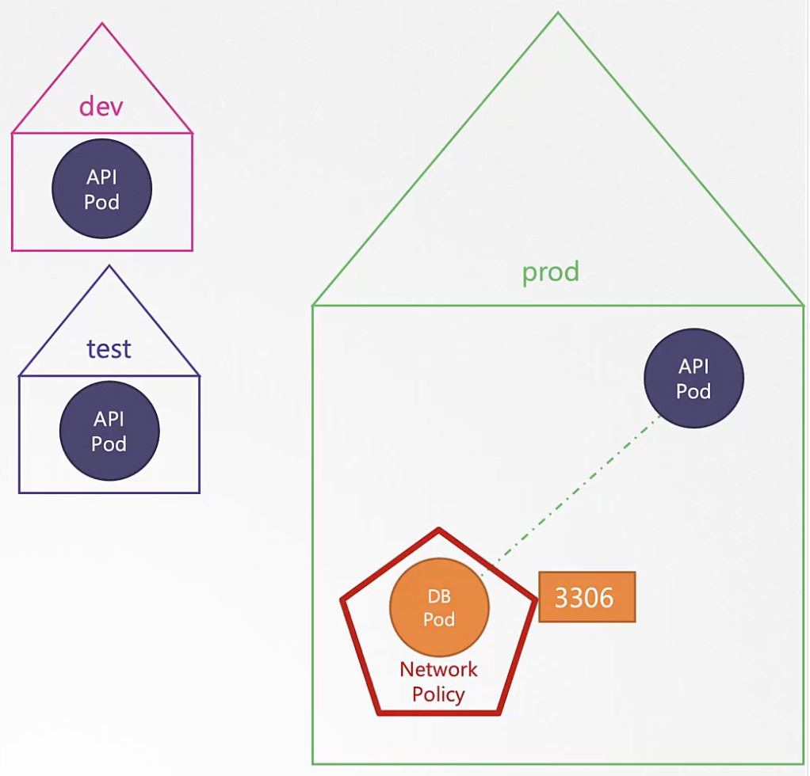

- **Network policies help control the flow of ingress and egress traffic to a group of pods** (using label selectors).
- By default, every pod in the cluster can reach out to any other pod within the cluster. This means, there’s no network policy by default.
- There’s no need for a network policy to allow the response. If the request is allowed by the network policy, the response will be allowed automatically (stateful behavior).
- **Network policies are implemented by the networking solution used in the cluster.** Currently, Flannel doesn’t support `NetworkPolicies`.
- The resulting network policy for a pod is the union of all the network policies associated with it. The order of rule evaluation does not matter.
- Network policies are firewalls applied directly to the matching pods (not through services).

### 3-Tier Web Application Example

In a 3 tier web application, the users should be able to reach the web service on port 80 or the API service on port 5000. Also, the DB service should only be reachable by the API service. 



These are the following traffic that should be allowed for each pod (service):

- Web service
    - Ingress on port 80 from anywhere
    - Egress on port 5000
- API service
    - Ingress on port 5000 from anywhere
    - Egress on port 3306
- DB service
    - Ingress on port 3306 from API pod

### Network Policy for DB pod

Label the DB pod as `role: db` and API pod as `role: api`. We can use these labels in the NetworkPolicy definition file to allow ingress traffic on port 3306 only from API pods. We don’t need to create an egress rule for the response from the the DB pod to the API pod as it is allowed automatically.



```yaml
apiVersion: networking.k8s.io/v1
kind: NetworkPolicy
metadata:
	name: db-policy
spec:
	podSelector:
		matchLabels:
			role: db
	policyTypes:
		- Ingress
	ingress:
		- from:
			- podSelector:
					matchLabels:
						role: api
			ports:
				- protocol: TCP
					port: 3306
```

```yaml
apiVersion: networking.k8s.io/v1
kind: NetworkPolicy
metadata:
	name: db-policy
spec:
	podSelector:
		matchLabels:
			role: db
	policyTypes:
		- Ingress
	ingress:
		- from:
			- podSelector:
					matchLabels:
						role: api
				namespaceSelector:
					matchLabels:
						name: prod
			ports:
				- protocol: TCP
					port: 3306
```

To restrict access to the DB pod to happen within the current namespace, select the namespace using `namespaceSelector`. In the example, only the API pods of `prod` namespace can connect to the DB pod in the `prod` namespace.



### Allowing Ingress Traffic from outside the Cluster

If we want to allow a backup server (`192.168.5.10`) present outside the cluster but within the same private network to pull data from the DB pod to perform backups, we can specify its IP address in the DB pod’s ingress rule. Now, the DB pod allows ingress traffic on port 3306 from both API pod and the backup server.

```yaml
apiVersion: networking.k8s.io/v1
kind: NetworkPolicy
metadata:
	name: db-policy
spec:
	podSelector:
		matchLabels:
			role: db
	policyTypes:
		- Ingress
	ingress:
		- from:
			- podSelector:
					matchLabels:
						role: api
			- ipBlock:
					cidr: 192.168.5.10/32
			ports:
				- protocol: TCP
					port: 3306
```

### Allowing Egress Traffic to outside the Cluster

If the DB pod needs to push a backup to a backup server (`192.168.5.10`) present outside the cluster but within the same private network, we can create an egress rule on the DB pod’s NetworkPolicy.

```yaml
apiVersion: networking.k8s.io/v1
kind: NetworkPolicy
metadata:
	name: db-policy
spec:
	podSelector:
		matchLabels:
			role: db
	policyTypes:
		- Ingress
		- Egress
	ingress:
		- from:
			- podSelector:
					matchLabels:
						role: api
			ports:
				- protocol: TCP
					port: 3306
	egress:
		- to:
			- ipBlock:
					cidr: 192.168.5.10/32
			ports:
				- protocol: TCP
					port: 80
```