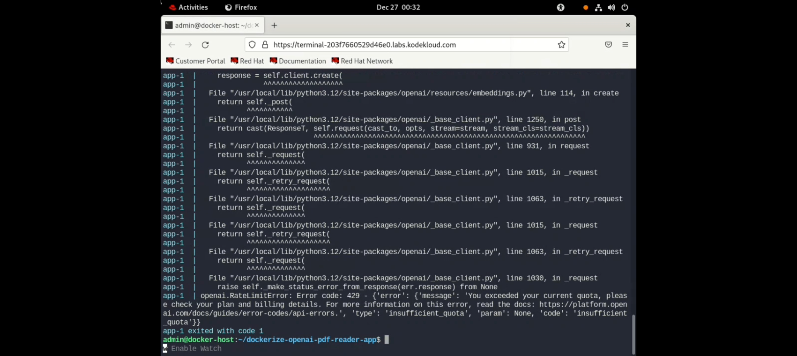

# Objective

To implement a conversational search of local available PDF documents using the OpenAI Langchain Framework and Python programming.

Architecture Diagram

System Requirements:

Base Operating System (Windows / Linux / MacOS)
DockerHub Login
GitHub.com Login
OpenAI API Secret Key
Docker Desktop (Not required if working with Linux CLI)

Setup Background:

BaseOS:
The host operating system were the complete tech stack described in architecture diagram will be running.
Install Docker Desktop locally;
Secure, out-of-the-box containerization software offering developers and teams a robust, hybrid toolkit to build, share, and run applications anywhere.
Create a hub.docker.com login:
To download / upload the changes to docker image.
GitHub.com login:
To make changes to source code of python / Dockerfile / Docker Compose config.
OpenAI API Secret Token:
In order to query the OpenAI API the request from the BaseOS system has to be authenticated. Secret to be exported like below: export OPENAI_API_KEY=’xxx’ or edit the docker-compose.yml file.

Implementation Procedure:
Make sure to install the application “Docker Desktop” from Internet.

2. Execute docker command to check the working.

3. Login to docker hub using the command “docker login”

4. Checkout the GitHub code-base with Dockerfile , Docker compose , OpenAI PDF reader app, and PDF reader program

5. Build the docker image using docker compose config and run the container

8. Login to dockerhub , tag the docker image and push it to dockerhub.

9. Verify the uploaded dockerhub image from dockerhub portal

    
Reference

https://medium.com/@onkarmishra/using-langchain-for-question-answering-on-own-data-3af0a82789ed
https://youtu.be/CpZdoYO9xDI?si=wO_bJPFbbRpRVCwC