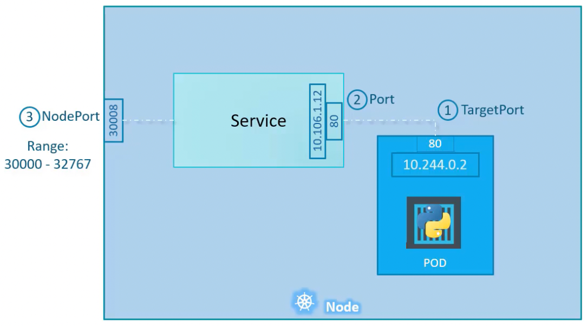
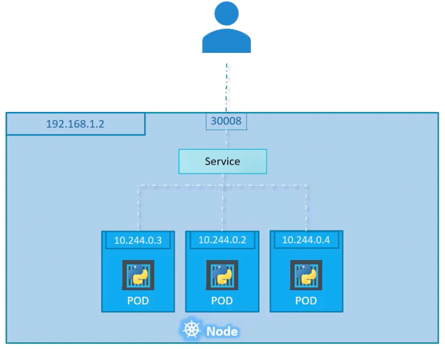

- Kubernetes services enable communication between various components within and outside of the application. They enable loose coupling between micro-services in our application.
- **Services are static IPs that can be attached to a pod or a group of pods using label selectors. They are not attached to deployments.**
- Services prevent us from using the pod IP addresses for communication which could change when the pod is restarted.
- **Lifecycle of pod and service are not connected.** So even if a pod dies, we can restart it and attach the original service to have the same IP.
- **Every service spans the entire cluster (all the nodes in the cluster)**
- **Every service has a unique IP across the K8s cluster**
- Kubernetes creates a default ClusterIP Service which forwards requests from within the cluster to the Kubernetes master (API Server). So, there is at least 1 service in every Kubernetes cluster.
- K8s services are of three types:
    - NodePort
    - ClusterIP
    - LoadBalancer

# NodePort Service

Consider an application running in a pod on a node which is on the same network as our laptop, we could SSH into the node and then reach the application by its IP on the Kubernetes network (`10.244.0.0/16`). But doing an SSH into the node to access the application is not the right way. 


- NodePort service maps a port on the node (Node Port) to a port on the pod (Target Port) running the application. This will allow us to reach the application on the node’s IP address.
- Allowed range for NodePort: 30,000 - 32,767



```yaml
apiVersion: v1
kind: Service
metadata:
	name: myapp-service
spec:
	type: NodePort
	ports:
		- targetPort: 80
			port: 80
			nodePort: 30008
	selector:
		app: myapp
		type: front-end
```

- `selector` is used to select target pods for the service
- `port` - port on which the service would be accessible
- `targetPort` - port on the pod to which the requests would be forwarded
- `nodePort` - port on the node

- If there are multiple target pods on the same node, the service will automatically load balance to these pods.



- If the target pods span multiple nodes in the cluster, as the NodePort service will span the entire cluster, it will map the target port on the pods to the same node port on all the nodes in the cluster, even the nodes that don’t have the application pod running in them. This will make the application available on the IP addresses of all of the nodes in the cluster.


# ClusterIP Service

- Consider a 3-tier application running on a K8s cluster. How will different tiers communicate with each other? Using IPs to communicate is not good as it can change when the pods are restarted. Also, how can we load balance if we have multiple pods in the same tier.


- ClusterIP Service groups similar pods and provides a single interface to access those pods. We don’t have to access the pods using their IP addresses.
- Enables access to the service from within the K8s cluster (internal)
- It automatically load balances to the target pods.
- **Service name should be used by other pods to communicate with the service.**
- Useful in deploying micro-services architecture on a K8s cluster.

```yaml
apiVersion: v1
kind: Service
metadata:
	name: back-end
spec:
	type: ClusterIP
	ports:
		- targetPort: 80
			port: 80
	selector:
		app: myapp
		type: back-end
```

- `selector` is used to select target pods for the service
- `port` - port on which the service would be accessible
- `targetPort` - port on the pod to which the requests would be forwarded

# LoadBalancer Service

- Consider the case where we have to route the incoming traffic to the front-end of two applications. If the applications are using NodePort service, they can be accessed at different node ports using the IPs of any of the nodes. But, we cannot use higher order ports for our application as they are non standard. Also, how do we load balance to the nodes (the application can be accessed at any of the nodes by using their IP addresses). For these, we need to use a Load Balancer service.


- LoadBalancer Service leverages the native layer-4 load balancer of the cloud provider to expose the application on a single IP (NLB’s IP) and load balance to the nodes. So, if a node becomes unhealthy, the NLB will redirect the incoming requests to a healthy node.
- Any NodePort service can be converted to use the cloud provider’s load balancer by setting `type: LoadBalancer` in the config.yaml file.
- LoadBalancer uses NodePort service behind the scenes and sets up a layer-4 load balancer of the cloud provider to load balance to the nodes on the high order node port.

```yaml
apiVersion: v1
kind: Service
metadata:
	name: myapp-service
spec:
	type: LoadBalancer
	ports:
		- targetPort: 80
			port: 80
			nodePort: 30008
	selector:
		app: myapp
		type: front-end
```



💡 The downside of this is that each service that you expose will require its own public IP (Network Load Balancer) as NLB cannot redirect to specific application based on URL or path. This makes this approach expensive if we have multiple applications to load balance to. The solution is to use an Ingress, which is an Application Load Balancer present within the cluster with an single NLB present outside to load balance to the nodes.

⛔ LoadBalancer Service is only supported on some cloud platforms. On non-supported cloud providers or local machines, it will behave as a NodePort service.

